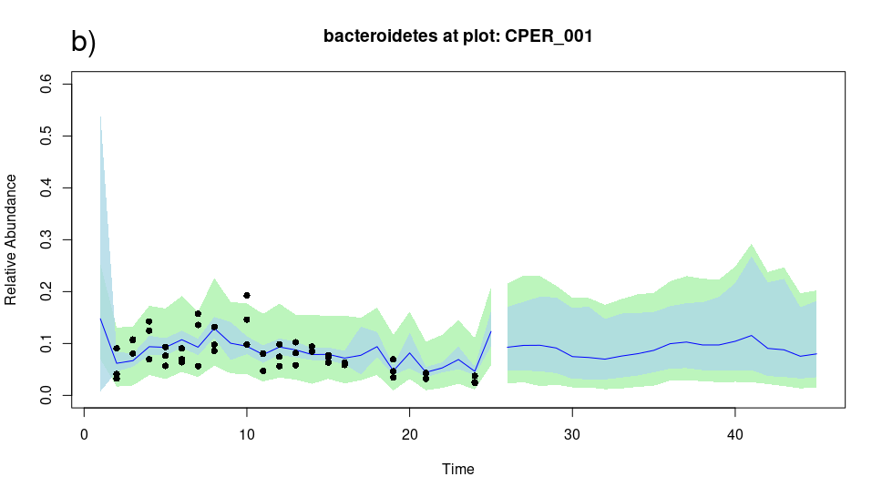
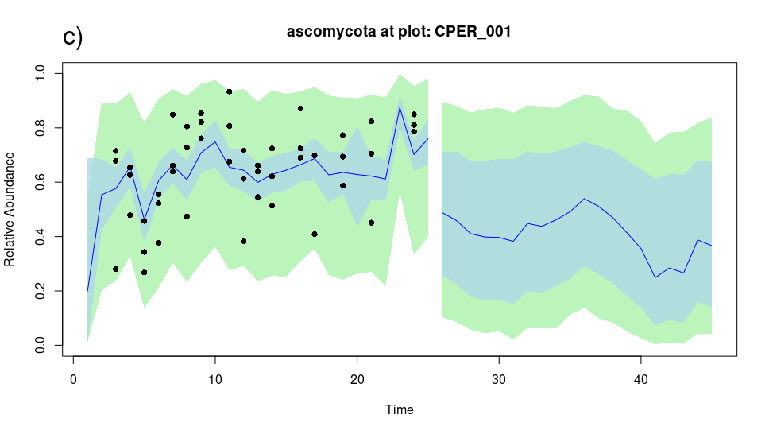
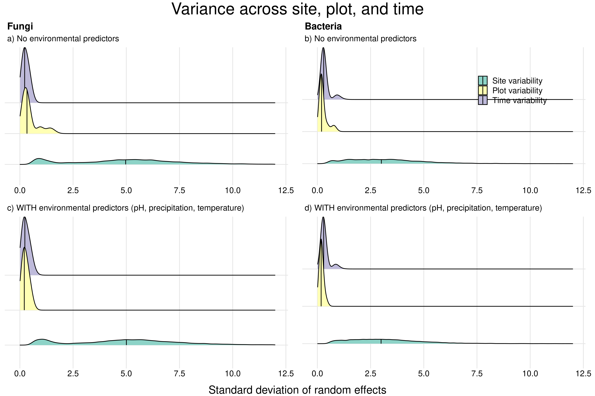
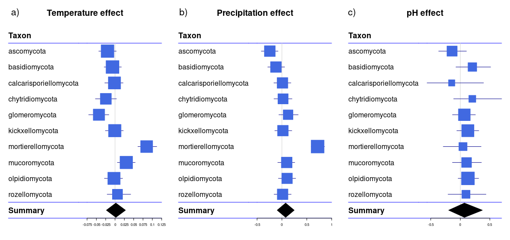
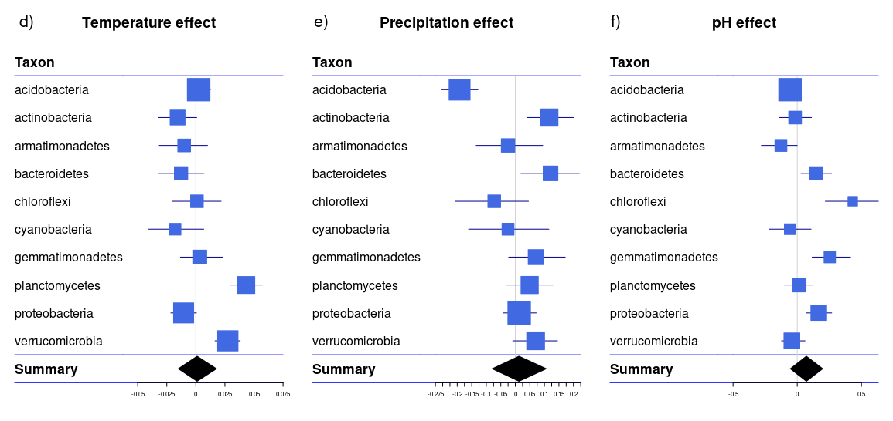
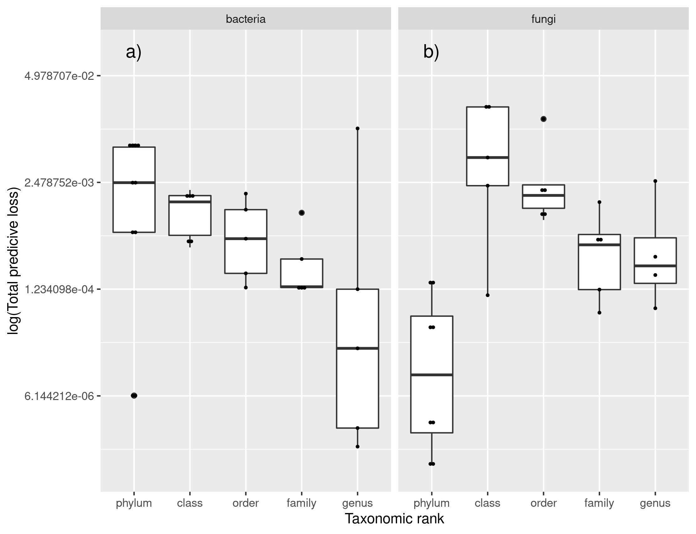
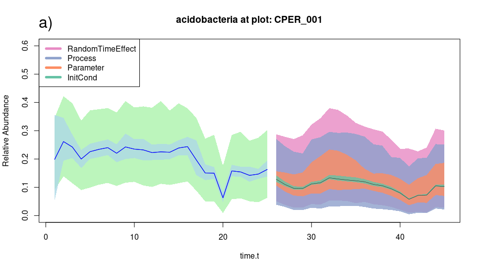

```{r setup, include=FALSE}
knitr::opts_chunk$set(echo = FALSE)
library(knitr)
```

## Overview

This analysis used state-space hierarchical models to explore spatio-temporal trends in the relative abundances of soil microbes. Dozens of microbial groups were modeled at the plot level, with 67 plots located within 5 sites across the United States (Fig 1). Overall, spatial variability eclipsed temporal variability (Fig 2), and many groups displayed sensitivity to environmental conditions (Fig 3). Our predictive ability varied by taxonomic ranking (Fig 4). The majority of our predictive uncertainty came from process error (Fig 5), indicating either that more model complexity/predictors will necessary to capture microbial abundance trends, or that there is inherent stochasticity that statistical models cannot explain (the answer, of course, is somewhere in the middle).

```{r, echo=FALSE}
include_graphics("images/Figure1a.png")


```

**Figure 1.** Example model fits and forecasts of 3 different microbial groups (a: Acidobacteria, b: Bacteroidetes, c: Ascomycota) at the same plot, CPER_001, located at the Colorado Plains Experimental Range. Observed points are plotted in black; credible intervals (where we expect the "true mean" to be, with 95% confidence) are in blue; and predictive intervals (where we expect observations to be, with 95% confidence) are in green. As new data is added to the model, the predictions are expected to increase in accuracy.

## Spatiotemporal variability

We hypothesized that spatial variability would eclipse temporal variability. To test this, we estimated random effects (with a mean of 0) to capture variation specific among plots, sites, and time points. The standard deviation of these random effects was estimated using 1000 Markov Chain Monte Carlo samples from the posterior densities (which is on the low end of samples - these models are currently re-fitting ). The these samples were drawn for ten bacterial phyla and ten fungal phyla (resulting in 10000 draws per parameter), and the resulting distributions are visible in Figure 2. Variability among the five study sites was much larger than variability among plots or variability among time points. 

To test whether variability is explainable by environmental conditions (such as temperature, precipitation, and pH), we fit models with and without environmental conditions. For fungal models, temporal (and plot) variability did indeed become negligible once environmental factors were considered. For bacterial models, temporal and plot variablility did not change substantially once environmental predictors were included. This figure will likely change further as additional predictors (such as soil carbon, soil nitrogen, and plant community characteristics) are included.


```{r, echo=FALSE}

```

**Figure 2.** Ridge plots showing the density of 10,000 posterior samples of standard deviations of time random effects, plot random effects, and site random effects. a) Sample densities for ten fungal phyla for models in which environmental predictors were excluded. b) Sample densities for ten bacterial phyla for models in which environmental predictors were excluded. c) Sample densities for ten fungal phyla for models in which pH, temperature, and precipitation were included. d) Sample densities for ten bacterial phyla for models in which pH, temperature, and precipitation were included. For all four cases, variability among sites is larger than among-plot or among-time variability.

## Sensitivity to environmental factors

Our hypothesis that bacteria are more sensitive then fungi to environmental conditions is supported by our results, but our sample size is relatively low - 10 bacterial and 10 fungal phyla. The effect of temperature was significant (e.g. 95% confidence interval did not overlap with zero) for 3 fungal groups (Fig 3a) and 4 bacterial groups (Fig 3d). The effect of precipitation was significant for 2 fungal groups (Fig 3b) and 3 bacterial groups (Fig 3e). The effect of pH was significant for 0 fungal groups (Fig 3c) and five bacterial groups (Fig 3f). Overall, 9 bacterial groups were sensitive to at least one environmental factor, while only 5 fungal groups were sensitive to at least one environmental factor. 

### Fungi
```{r, echo=F}

```

### Bacteria
```{r, echo=F}

```

**Figure 3.** Effect sizes of temperature (a and d), precipitation (b and e), and pH (c and f), estimated from 1500 draws from the posterior distribution of each model. Models were fit separately for each of 10 prevalent bacterial phyla and 10 prevalent fungal phyla.


## Taxonomic Ranking

One microbial phylum can contain thousands of taxa that experience a range of selective pressures - therefore, trends at the phylum level may obscure trends at finer taxonomic resolutions. We expected that finer taxonomic resolutions would allow for more successful predictions. To test this, models were fit at five ranks (phylum, class, order, family, genus) using the five most prevalent taxa at each rank (i.e. the taxa present in the highest number of samples). Contrary to our expectations, predictive power decreased at finer taxonomic ranks for bacteria, while fungi showed a similar trend, except with models at the "phylum" rank performing the worst (Fig 4). These results in particular should be taken with a grain of salt, because the author suspects there may be an error in her Predictive Loss algorithm.

```{r, echo=F}

```
**Figure 4.** In-sample predictive loss for models fit to 5 taxa at 5 fungal taxonomic ranks and 5 bacterial taxonomic ranks. Values are on a log scale, such that lower values indicate higher predictive loss and worse model performance. Predictive loss is calculated as the total residual sum of squares plus the total predictive variance.

## Uncertainty Partitioning

Uncertainty partitioning can be used to improve models, identify deficits in data, or establish forecast horizons (Dietze 2017). We used our models, which were fit to two years of data (approx. 25 timepoints), to forecast forward 20 additional time points. We propagated uncertainty in our models forward in time, and tracked how sources of uncertainty increased or decreased (Fig 5b). Process error remains the largest source of uncertainty throughout our forecast period, indicating that our model is either missing critical structure, or that the underlying process (fluctuations in microbial abundance) has a large amount of inherent stochasticity (Fig 5b). Initial condition error declines exponentially, and uncertainty introduced by both random time effects and model parameters tends to fluctuate over time. One important factor excluded from this analysis is *driver uncertainty*, such as uncertainty in our knowledge of precipitation or temperature values. If this were a true forecast, then it would rely on external forecasts of those drivers, which would introduce addition fluctuation; this analysis instead uses known historical weather values.

```{r, echo=F}

include_graphics("images/Figure5b.png")
```

**Figure 5.** Uncertainty partitioning for one bacterial phylum (Acidobacteria) at one plot, representing trends seen across locations and taxa. a) Calibration fit, with 95% credible interval in blue and 95% predictive interval in green, and forecast uncertainty with color legend in top left. InitCond = initial condition uncertainty, introduced by variation within the starting point of the forecast; Process = process uncertainty, introduced by stochasticity within the system that our model does not capture; Parameter = parameter uncertainty, introduced by variability within our parameter estimates (such as coefficients and intercepts); RandomTimeEffect = uncertainty due to random temporal variation specific to each sampling time point. 


